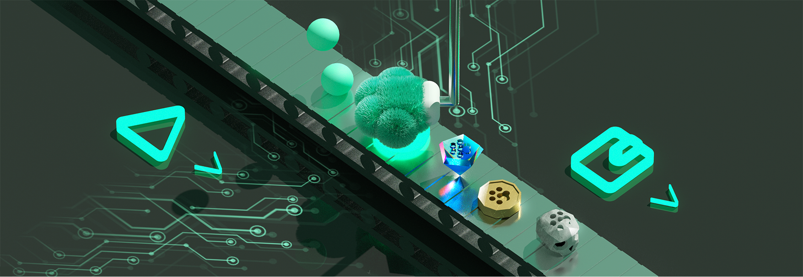

## ForTem

## 📝 Latest Release Notes

> [View our latest release notes on Discord](https://discord.com/channels/1440613478611157014/1489097326763966484)

## 📊 Team Activity Metrics

This repository uses **GitHub Metrics** to automatically track and visualize our team's development activity — including commits, pull requests, issues, languages used, and contributions across repositories.

> Updated daily (Asia/Seoul timezone)

---

## ForTem builds the most fair and transparent on-chain marketplace for gaming.

### A Sui-powered NFT Marketplace where players truly own, trade, and explore the value of in-game assets.

## Our Vision

#### "To become the leading Web3 gaming marketplace on Sui — connecting players, creators, and games through verifiable digital ownership."

## About ForTem

- [WEBSITE 🎮] : [https://fortem.gg](https://fortem.gg)
- [DOCS 📚] : [https://docs.fortem.gg](https://docs.fortem.gg)
- [HELP CENTER 💬] : [https://help.fortem.gg](https://help.fortem.gg)

## ForTem Social Media

- [DISCORD] https://discord.gg/fortem
- [TWITTER / X] https://x.com/ForTem_Official

---

## 🛠 Powered By

- GitHub Actions
- [lowlighter/metrics](https://github.com/lowlighter/metrics)
- Automated activity tracking
- Fully customizable visualization options
